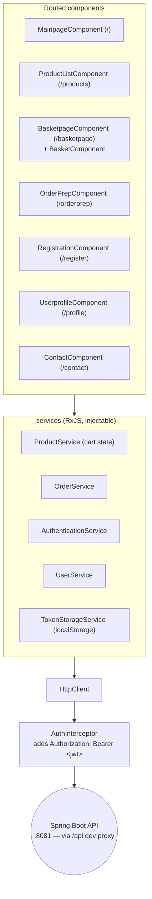

# 🥩 Meating — Store Frontend (Angular SPA)

> The **Angular 13** single-page frontend for the *Meating* beef-jerky shop: a component-based UI for
> browsing products, managing a reactive shopping cart, registering / logging in, and placing orders.
> It talks to the companion **Spring Boot** REST backend over JSON, attaching a JWT to authenticated
> requests.

<p>
  
  
  
  
  
  
  
</p>

> ℹ️ This is **one half of a two-app system**. It is a pure client — it needs the separate **Meating
> Store Backend** (Spring Boot REST API) running on `http://localhost:8081` to fetch products, log in
> and place orders.

---

## Table of Contents

1. [Purpose](#-purpose)
2. [Main Features](#-main-features)
3. [Tech Stack](#-tech-stack)
4. [Architecture](#-architecture)
5. [Routes](#-routes)
6. [State & Auth](#-state--auth)
7. [Quickstart](#-quickstart)
8. [Build & Deploy](#-build--deploy)
9. [Screenshots](#-screenshots)
10. [Project Structure](#-project-structure)
11. [Known Limitations](#-known-limitations)

---

## 🎯 Purpose

**Meating Front** (`meating-front`) is the browser UI of a small but complete online store. A visitor
can browse the product catalogue, add items to a basket, register / log in, and place an order. The
cart is held reactively in the client and mirrored to `localStorage`, and authenticated calls carry a
JWT obtained from the backend.

It is a portfolio/learning project that demonstrates a **conventional Angular SPA**: routed components,
injectable RxJS services, an HTTP interceptor for auth, Angular Material + a custom theme, and a
production build wired for GitHub-Pages-style hosting.

---

## ✨ Main Features

- ✅ **Product catalogue** with add-to-cart
- ✅ **Reactive shopping cart** — in-memory state mirrored to `localStorage`, exposed via an RxJS `BehaviorSubject`
- ✅ **Registration & login** — stores the returned user (with JWT) in `localStorage`
- ✅ **JWT auth interceptor** — attaches `Authorization: Bearer <token>` to outgoing API calls
- ✅ **Guest & registered checkout** flows (order preparation with delivery details)
- ✅ **Angular Material** UI with a custom SCSS theme
- ✅ **Dev proxy** to the backend (`/api` → `http://localhost:8081`)
- ✅ **Production build** committed under `docs/` (GitHub Pages ready)

---

## 🧰 Tech Stack

| Area | Technology |
|---|---|
| Language | **TypeScript 4.5** |
| Framework | **Angular 13.2** (Router, Forms — Reactive + Template, `HttpClient`) |
| UI | **Angular Material + CDK 13.3** (`MatIconModule`), custom theme (`custom-theme.scss`) |
| Reactive | **RxJS 7.5** (`BehaviorSubject` for cart/session state) |
| Runtime | **zone.js 0.11** |
| Tooling | **Angular CLI 13.2.5**, SCSS/CSS theming |
| Testing | **Karma + Jasmine** (scaffolding) |
| Session | `localStorage` (cart + auth token) via `TokenStorageService` |

---

## 🏛 Architecture

Routed **components** delegate to injectable **services**, which call the backend through `HttpClient`.
An `AuthInterceptor` transparently attaches the JWT to every outgoing request.



---

## 🧭 Routes

Defined in `app-routing.module.ts`:

| Path | Component | Purpose |
|---|---|---|
| `/` | `MainpageComponent` | Landing page |
| `/products` | `ProductListComponent` | Catalogue + add-to-cart |
| `/basketpage` | `BasketpageComponent` (hosts `BasketComponent`) | Shopping cart |
| `/orderprep` | `OrderPrepComponent` | Checkout — delivery details & order placement |
| `/register` | `RegistrationComponent` | Sign up |
| `/profile` | `UserprofileComponent` | Logged-in user profile |
| `/contact` | `ContactComponent` | Contact page |

---

## 🔐 State & Auth

- **Cart** — `ProductService` keeps the basket in memory, mirrors it to `localStorage`, and publishes
  changes through an RxJS `BehaviorSubject`, so any subscribed component updates reactively.
- **Session** — on login, `AuthenticationService` stores the returned user (including the JWT) via
  `TokenStorageService` (`localStorage`).
- **Authenticated requests** — `_helpers/auth.interceptor.ts` is registered as an `HTTP_INTERCEPTORS`
  provider and adds `Authorization: Bearer <token>` to outgoing calls so the backend can resolve the
  user from the JWT.

---

## 🚀 Quickstart

### Prerequisites
- Node.js + npm, **Angular CLI 13** (`npm i -g @angular/cli@13`)
- The **Meating Store Backend** running on `http://localhost:8081`

### Run
```bash
npm install
ng serve      # http://localhost:4200
```
`ng serve` automatically uses `src/proxy.conf.json` (wired in `angular.json`), which forwards
`/api/*` calls to `http://localhost:8081` and strips the `/api` prefix. The app's API base is
`api/` (`src/environments/environment.ts`), so no code change is needed for local development — just
make sure the backend is up.

### Tests
```bash
ng test       # Karma + Jasmine (scaffolding only)
```

---

## 📦 Build & Deploy

```bash
ng build      # production build → outputs to docs/
```

The Angular build `outputPath` is set to **`docs/`** (see `angular.json`), and a pre-built bundle is
committed there — this is the **GitHub Pages**-style layout (serve the repo's `docs/` folder). For a
non-Pages host, point the build wherever you deploy and ensure the served API base resolves to your
backend.

---

## 🖼 Screenshots

Located in `SCREENSHOTS/` (Polish UI labels):

| File | Screen |
|---|---|
| `produkty.png` | Products / catalogue |
| `koszyk.png` | Basket (cart) |
| `logowanie.png` | Login |
| `rejestracja.png` | Registration |
| `kontakt.png` | Contact |

---

## 📁 Project Structure

```
internet-store-frontend-master/
├── angular.json              # build outputPath=docs, serve proxyConfig=src/proxy.conf.json
├── package.json              # Angular 13.2, Material 13.3, RxJS 7.5, TS 4.5
├── docs/                     # committed production build (GitHub Pages ready)
├── SCREENSHOTS/              # UI screenshots
└── src/
    ├── main.ts, index.html, styles.css, custom-theme.scss
    ├── proxy.conf.json       # /api → http://localhost:8081 (dev)
    ├── environments/         # environment.ts / environment.prod.ts (apiUrl: 'api/')
    ├── assets/img/           # logos + product imagery
    └── app/
        ├── app.module.ts, app-routing.module.ts, app.component.*
        ├── _helpers/         # auth.interceptor.ts
        ├── _services/        # authentication, order, product, user, token-storage
        ├── mainpage/         # MainpageComponent
        ├── product/          # ProductModel + productList/ProductListComponent
        ├── order/            # basket, basketpage, order-prep (+ OrderModel)
        ├── user/             # User model + registration, userprofile
        └── contact/          # ContactComponent
```

---

## ⚠️ Known Limitations

- **Backend-dependent** — nothing works without the Spring Boot API on `:8081` (products, auth, orders).
- **Client-side-only auth** — the JWT lives in `localStorage`; there are no route guards, so
  "protected" views are reachable without a session (the API is what gates data).
- **Light Material usage** — only `MatIconModule` (+ CDK and a custom theme) is imported despite the
  Material dependency.
- **Committed build output** — the `docs/` production bundle is checked into source control.
- **Tests are scaffolding only** — the generated Karma/Jasmine specs are not meaningfully filled in.
